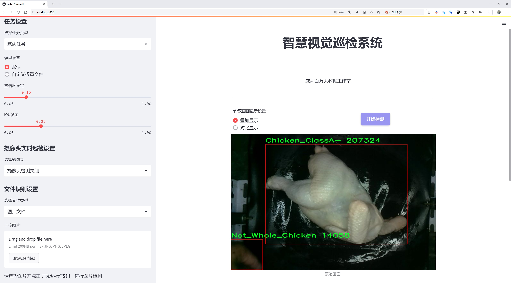
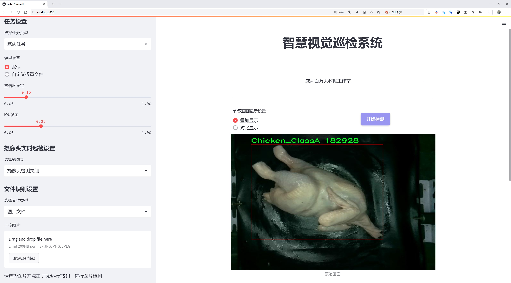
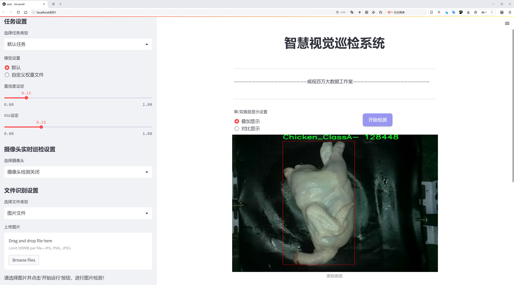
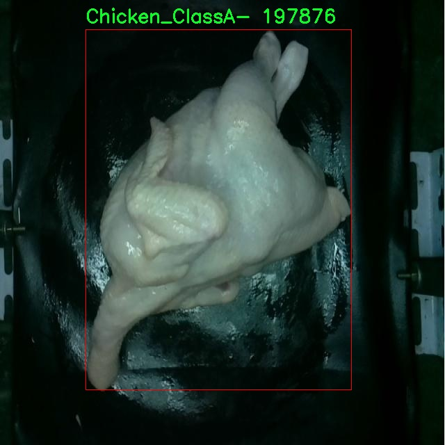
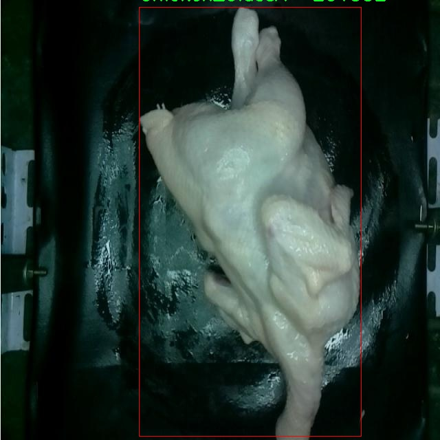
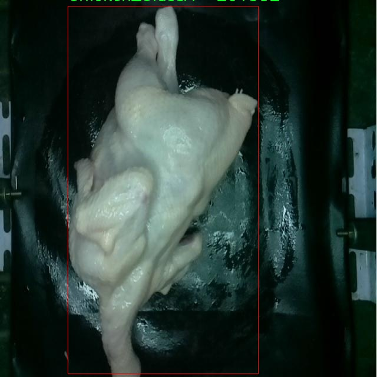
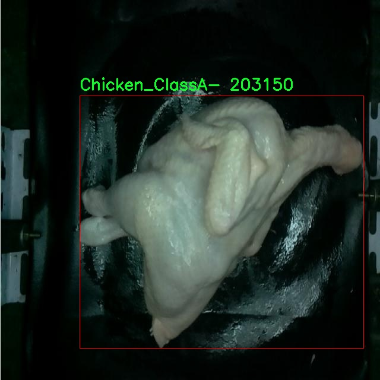

# 鸡肉品质分级与分类检测系统源码分享
 # [一条龙教学YOLOV8标注好的数据集一键训练_70+全套改进创新点发刊_Web前端展示]

### 1.研究背景与意义

项目参考[AAAI Association for the Advancement of Artificial Intelligence](https://gitee.com/qunshansj/projects)

项目来源[AACV Association for the Advancement of Computer Vision](https://gitee.com/qunmasj/projects)

研究背景与意义

随着全球经济的发展和人们生活水平的提高，肉类消费尤其是鸡肉的需求持续增长。鸡肉因其高蛋白、低脂肪的特性，成为了人们餐桌上不可或缺的食品之一。然而，鸡肉的品质直接影响到消费者的健康和饮食体验，因此，建立一个高效、准确的鸡肉品质分级与分类系统显得尤为重要。传统的鸡肉品质评估方法多依赖于人工检验，不仅耗时耗力，而且受主观因素影响较大，难以保证一致性和准确性。因此，基于计算机视觉和深度学习技术的自动化检测系统应运而生，成为解决这一问题的有效途径。

在众多深度学习模型中，YOLO（You Only Look Once）系列因其快速的检测速度和较高的准确率而广泛应用于物体检测领域。YOLOv8作为该系列的最新版本，结合了多种先进的技术和优化策略，能够在实时性和精度之间取得良好的平衡。针对鸡肉品质的分级与分类任务，改进YOLOv8模型不仅可以提高检测的准确性，还能有效缩短检测时间，为生产和销售环节提供实时反馈，进而提升整个供应链的效率。

本研究所使用的数据集包含1800张鸡肉图像，涵盖了五个不同的类别：Chicken_ClassA、Chicken_ClassA+、Chicken_ClassB、Chicken_ClassC以及Not_Whole_Chicken。这些类别的划分不仅反映了鸡肉的外观特征，还与其市场价值和消费者的选择密切相关。通过对这些图像进行深度学习训练，改进YOLOv8模型能够自动识别和分类不同品质的鸡肉，进而为消费者提供更为科学的选择依据。同时，该系统的应用也将推动鸡肉行业的标准化进程，促进产品质量的提升。

此外，随着食品安全问题的日益严重，消费者对食品质量的关注度不断提高。建立一个基于改进YOLOv8的鸡肉品质分级与分类系统，不仅可以提升消费者对产品的信任度，还能帮助生产企业优化生产流程，降低因品质问题导致的经济损失。通过实现智能化的品质检测，企业能够更好地满足市场需求，提升竞争力。

综上所述，基于改进YOLOv8的鸡肉品质分级与分类系统的研究，不仅具有重要的理论意义，还具有广泛的应用前景。它将为鸡肉行业的智能化发展提供新的思路和方法，推动食品质量检测技术的进步，最终实现提升消费者满意度和保障食品安全的目标。

### 2.图片演示







##### 注意：由于此博客编辑较早，上面“2.图片演示”和“3.视频演示”展示的系统图片或者视频可能为老版本，新版本在老版本的基础上升级如下：（实际效果以升级的新版本为准）

  （1）适配了YOLOV8的“目标检测”模型和“实例分割”模型，通过加载相应的权重（.pt）文件即可自适应加载模型。

  （2）支持“图片识别”、“视频识别”、“摄像头实时识别”三种识别模式。

  （3）支持“图片识别”、“视频识别”、“摄像头实时识别”三种识别结果保存导出，解决手动导出（容易卡顿出现爆内存）存在的问题，识别完自动保存结果并导出到tempDir中。

  （4）支持Web前端系统中的标题、背景图等自定义修改，后面提供修改教程。

  另外本项目提供训练的数据集和训练教程,暂不提供权重文件（best.pt）,需要您按照教程进行训练后实现图片演示和Web前端界面演示的效果。

### 3.视频演示

[3.1 视频演示](https://www.bilibili.com/video/BV1Kp48e9EBu/)

### 4.数据集信息展示

##### 4.1 本项目数据集详细数据（类别数＆类别名）

nc: 5
names: ['Chicken_ClassA', 'Chicken_ClassA-', 'Chicken_ClassB', 'Chicken_ClassC', 'Not_Whole_Chicken']


##### 4.2 本项目数据集信息介绍

数据集信息展示

在现代农业与食品安全领域，鸡肉品质的分级与分类至关重要。为了提升这一过程的效率与准确性，我们构建了一个专门用于训练改进YOLOv8模型的高质量数据集，命名为“chick_detector”。该数据集旨在通过深度学习技术，实现对鸡肉品质的自动化识别与分类，从而为相关行业提供智能化解决方案。

“chick_detector”数据集包含五个主要类别，分别为：Chicken_ClassA、Chicken_ClassA-、Chicken_ClassB、Chicken_ClassC以及Not_Whole_Chicken。这些类别的划分不仅考虑了鸡肉的外观特征，还综合了肉质、色泽、纹理等多种因素，确保模型能够在实际应用中做出准确的判断。具体而言，Chicken_ClassA代表的是最高品质的鸡肉，通常具有鲜艳的色泽和良好的纹理；而Chicken_ClassA-则是略低于ClassA的鸡肉，可能在某些方面存在轻微的瑕疵。Chicken_ClassB和Chicken_ClassC则分别代表中等品质和较低品质的鸡肉，适用于不同的市场需求。最后，Not_Whole_Chicken类别则用于标识那些不完整的鸡肉产品，确保系统能够准确识别并分类这些特殊情况。

数据集的构建过程经过了严格的标准化和筛选，确保每个类别的样本都具有代表性。为了提高模型的泛化能力，我们在数据采集阶段涵盖了多种不同来源的鸡肉样本，包括超市、农场和加工厂等。这种多样性不仅丰富了数据集的内容，也为模型的训练提供了更为广泛的背景信息。此外，数据集中每个样本都经过精细标注，确保训练过程中的数据准确性，进而提升模型的性能。

在数据集的使用过程中，我们采用了数据增强技术，以增加样本的多样性和数量。这些技术包括旋转、缩放、裁剪、颜色变换等，旨在模拟不同的拍摄条件和环境变化，从而使模型在面对实际应用时更加鲁棒。通过这些方法，我们期望能够训练出一个高效且准确的YOLOv8模型，能够在实时场景中快速识别和分类鸡肉品质。

此外，数据集的设计也考虑到了实际应用中的需求。例如，在食品加工和销售环节，快速而准确的鸡肉品质分类能够显著提高工作效率，减少人力成本，并降低因品质不合格而导致的经济损失。因此，“chick_detector”不仅是一个技术性的数据集，更是一个能够为行业带来实际价值的工具。

综上所述，“chick_detector”数据集为改进YOLOv8的鸡肉品质分级与分类系统提供了坚实的基础。通过高质量的样本、多样化的类别和严格的标注，我们相信该数据集能够有效支持相关研究与应用，推动鸡肉品质检测技术的进步与发展。










### 5.全套项目环境部署视频教程（零基础手把手教学）

[5.1 环境部署教程链接（零基础手把手教学）](https://www.ixigua.com/7404473917358506534?logTag=c807d0cbc21c0ef59de5)


[5.2 安装Python虚拟环境创建和依赖库安装视频教程链接（零基础手把手教学）](https://www.ixigua.com/7404474678003106304?logTag=1f1041108cd1f708b01a)

### 6.手把手YOLOV8训练视频教程（零基础小白有手就能学会）

[6.1 手把手YOLOV8训练视频教程（零基础小白有手就能学会）](https://www.ixigua.com/7404477157818401292?logTag=d31a2dfd1983c9668658)

### 7.70+种全套YOLOV8创新点代码加载调参视频教程（一键加载写好的改进模型的配置文件）

[7.1 70+种全套YOLOV8创新点代码加载调参视频教程（一键加载写好的改进模型的配置文件）](https://www.ixigua.com/7404478314661806627?logTag=29066f8288e3f4eea3a4)

### 8.70+种全套YOLOV8创新点原理讲解（非科班也可以轻松写刊发刊，V10版本正在科研待更新）

由于篇幅限制，每个创新点的具体原理讲解就不一一展开，具体见下列网址中的创新点对应子项目的技术原理博客网址【Blog】：


[8.1 70+种全套YOLOV8创新点原理讲解链接](https://gitee.com/qunmasj/good)

### 9.系统功能展示（检测对象为举例，实际内容以本项目数据集为准）

图9.1.系统支持检测结果表格显示

  图9.2.系统支持置信度和IOU阈值手动调节

  图9.3.系统支持自定义加载权重文件best.pt(需要你通过步骤5中训练获得)

  图9.4.系统支持摄像头实时识别

  图9.5.系统支持图片识别

  图9.6.系统支持视频识别

  图9.7.系统支持识别结果文件自动保存

  图9.8.系统支持Excel导出检测结果数据


### 10.原始YOLOV8算法原理

原始YOLOv8算法原理

YOLOv8是由Ultralytics公司于2023年1月10日发布的最新目标检测算法，作为YOLO系列的又一重要版本，它在YOLOv7的基础上进行了深度优化，展现出更为卓越的性能。YOLOv8的设计理念是通过卷积神经网络（CNN）直接对整个图像进行处理，避免了传统目标检测方法中滑动窗口和区域提议的复杂性，从而显著提高了检测的速度和精度。这种端到端的检测方式使得YOLOv8能够在实时应用中表现出色，尤其是在智能监控、自动驾驶和人脸识别等领域。

YOLOv8的网络结构由输入层、主干网络、颈部网络和头部网络四个主要部分组成。输入层负责对图像进行预处理，包括缩放、灰度填充和Mosaic数据增强等，以确保输入数据符合网络的要求。主干网络是YOLOv8的核心，通过一系列卷积操作对输入图像进行特征提取。每个卷积层都包含批归一化和SiLU激活函数，以提高模型的收敛速度和非线性表达能力。特别地，YOLOv8引入了C2f模块，这一模块借鉴了YOLOv7中的E-ELAN结构，通过跨层分支连接来增强模型的梯度流，进而改善目标检测的效果。

在特征提取的过程中，YOLOv8的主干网络还采用了SPP（Spatial Pyramid Pooling）结构，该结构通过多个最大池化层处理多尺度特征，从而提升了网络的特征抽象能力。这一设计使得YOLOv8能够更好地适应不同大小的目标，尤其是在复杂场景中，能够有效地捕捉到细节信息。颈部网络则利用特征金字塔网络（FPN）和路径聚合网络（PAN）结构，将不同尺度的特征图进行融合，确保信息的有效传递。通过这种方式，YOLOv8能够综合考虑多层次的特征信息，从而提升目标检测的精度。

在输出端，YOLOv8采用了解耦的检测头设计，通过两个并行的卷积分支分别计算回归和分类的损失。这种解耦的方式使得模型在处理分类和定位任务时能够更加灵活和高效。具体而言，YOLOv8采用了Task-Aligned Assigner方法，对分类分数和回归分数进行加权，以实现更精准的正样本匹配。此外，损失计算方面，YOLOv8使用了二元交叉熵（BCE）来计算分类损失，并结合分布焦点损失（DFL）和完全交并比（CIoU）损失函数来优化回归损失。这些创新的设计使得YOLOv8在精度和速度上都得到了显著提升。

YOLOv8的另一个重要特点是其采用了anchor-free的方法，相较于传统的anchor-based检测方法，YOLOv8在复杂环境下的检测精度和速度均有显著提高。这一方法的优势在于它能够更好地适应不同形状和大小的目标，减少了对先验框的依赖，从而提升了模型的泛化能力。然而，在某些复杂的场景中，例如水面环境下的小目标检测，YOLOv8仍然面临着定位误差和目标感知能力不足的问题。因此，针对这些不足，研究者们提出了对YOLOv8的改进方案，如引入BiFormer双层路由注意力机制和更小的检测头，以提升对小目标的感知能力。

总的来说，YOLOv8在目标检测领域展现出了强大的性能，其创新的网络结构和高效的算法设计使得它能够在多种应用场景中发挥重要作用。通过不断的优化和改进，YOLOv8不仅提高了检测精度和速度，还为后续的研究和应用提供了广阔的空间。随着YOLO系列算法的不断演进，YOLOv8无疑是当前目标检测技术的一个重要里程碑，展现了深度学习在计算机视觉领域的巨大潜力。


### 11.项目核心源码讲解（再也不用担心看不懂代码逻辑）

#### 11.1 ui.py

以下是对代码的核心部分进行保留和详细注释的版本：

```python
import sys
import subprocess

def run_script(script_path):
    """
    使用当前 Python 环境运行指定的脚本。

    Args:
        script_path (str): 要运行的脚本路径

    Returns:
        None
    """
    # 获取当前 Python 解释器的路径
    python_path = sys.executable

    # 构建运行命令，使用 streamlit 运行指定的脚本
    command = f'"{python_path}" -m streamlit run "{script_path}"'

    # 执行命令并等待其完成
    result = subprocess.run(command, shell=True)
    
    # 检查命令执行的返回码，非零表示出错
    if result.returncode != 0:
        print("脚本运行出错。")

# 实例化并运行应用
if __name__ == "__main__":
    # 指定要运行的脚本路径
    script_path = "web.py"  # 这里可以替换为实际的脚本路径

    # 调用函数运行脚本
    run_script(script_path)
```

### 代码注释说明：
1. **导入模块**：
   - `sys`：用于访问与 Python 解释器相关的变量和函数。
   - `subprocess`：用于执行外部命令和与其交互。

2. **`run_script` 函数**：
   - 该函数接受一个脚本路径作为参数，并使用当前 Python 环境运行该脚本。
   - 使用 `sys.executable` 获取当前 Python 解释器的路径，以确保脚本在正确的环境中运行。
   - 构建一个命令字符串，使用 `streamlit` 模块运行指定的脚本。
   - 使用 `subprocess.run` 执行构建的命令，并通过 `shell=True` 允许在 shell 中执行。
   - 检查命令的返回码，如果返回码不为零，则表示脚本运行出错，并打印错误信息。

3. **主程序块**：
   - 使用 `if __name__ == "__main__":` 确保只有在直接运行该脚本时才会执行以下代码。
   - 指定要运行的脚本路径（在这里是 `web.py`）。
   - 调用 `run_script` 函数来运行指定的脚本。

这个程序文件 `ui.py` 的主要功能是运行一个指定的 Python 脚本，具体来说是使用 Streamlit 框架来启动一个 Web 应用。程序首先导入了必要的模块，包括 `sys`、`os` 和 `subprocess`，以及一个自定义的路径处理函数 `abs_path`。

在 `run_script` 函数中，首先获取当前 Python 解释器的路径，这通过 `sys.executable` 实现。接着，构建一个命令字符串，这个命令使用当前的 Python 解释器来运行指定的脚本，具体是通过 `-m streamlit run` 来启动 Streamlit 应用。然后，使用 `subprocess.run` 来执行这个命令。该函数会在 shell 中运行命令，并等待其完成。如果命令执行的返回码不为零，表示运行过程中出现了错误，此时会打印出“脚本运行出错”的提示。

在文件的最后部分，使用 `if __name__ == "__main__":` 语句来确保只有在直接运行该脚本时才会执行以下代码。这里指定了要运行的脚本路径 `web.py`，并调用 `run_script` 函数来启动这个脚本。

总的来说，这个文件的作用是为用户提供一个简单的接口，通过命令行运行一个 Streamlit Web 应用，并处理可能出现的错误。

#### 11.2 code\ultralytics\trackers\utils\matching.py

以下是代码中最核心的部分，并附上详细的中文注释：

```python
import numpy as np
import scipy
from scipy.spatial.distance import cdist
from ultralytics.utils.metrics import bbox_ioa

def linear_assignment(cost_matrix: np.ndarray, thresh: float, use_lap: bool = True) -> tuple:
    """
    执行线性分配，使用 scipy 或 lap.lapjv。

    参数:
        cost_matrix (np.ndarray): 包含分配成本值的矩阵。
        thresh (float): 认为分配有效的阈值。
        use_lap (bool, optional): 是否使用 lap.lapjv。默认为 True。

    返回:
        包含以下内容的元组:
            - 匹配的索引
            - 'a' 中未匹配的索引
            - 'b' 中未匹配的索引
    """
    # 如果成本矩阵为空，返回空匹配和所有未匹配的索引
    if cost_matrix.size == 0:
        return np.empty((0, 2), dtype=int), tuple(range(cost_matrix.shape[0])), tuple(range(cost_matrix.shape[1]))

    if use_lap:
        # 使用 lap.lapjv 进行线性分配
        _, x, y = lap.lapjv(cost_matrix, extend_cost=True, cost_limit=thresh)
        matches = [[ix, mx] for ix, mx in enumerate(x) if mx >= 0]  # 匹配的索引
        unmatched_a = np.where(x < 0)[0]  # 'a' 中未匹配的索引
        unmatched_b = np.where(y < 0)[0]  # 'b' 中未匹配的索引
    else:
        # 使用 scipy.optimize.linear_sum_assignment 进行线性分配
        x, y = scipy.optimize.linear_sum_assignment(cost_matrix)  # 行 x，列 y
        matches = np.asarray([[x[i], y[i]] for i in range(len(x)) if cost_matrix[x[i], y[i]] <= thresh])
        if len(matches) == 0:
            unmatched_a = list(np.arange(cost_matrix.shape[0]))
            unmatched_b = list(np.arange(cost_matrix.shape[1]))
        else:
            unmatched_a = list(set(np.arange(cost_matrix.shape[0])) - set(matches[:, 0]))
            unmatched_b = list(set(np.arange(cost_matrix.shape[1])) - set(matches[:, 1]))

    return matches, unmatched_a, unmatched_b

def iou_distance(atracks: list, btracks: list) -> np.ndarray:
    """
    基于交并比 (IoU) 计算轨迹之间的成本。

    参数:
        atracks (list[STrack] | list[np.ndarray]): 轨迹 'a' 或边界框的列表。
        btracks (list[STrack] | list[np.ndarray]): 轨迹 'b' 或边界框的列表。

    返回:
        (np.ndarray): 基于 IoU 计算的成本矩阵。
    """
    # 将轨迹转换为边界框格式
    atlbrs = [track.tlbr for track in atracks] if not isinstance(atracks[0], np.ndarray) else atracks
    btlbrs = [track.tlbr for track in btracks] if not isinstance(btracks[0], np.ndarray) else btracks

    # 初始化 IoU 矩阵
    ious = np.zeros((len(atlbrs), len(btlbrs)), dtype=np.float32)
    if len(atlbrs) and len(btlbrs):
        # 计算 IoU
        ious = bbox_ioa(
            np.ascontiguousarray(atlbrs, dtype=np.float32), np.ascontiguousarray(btlbrs, dtype=np.float32), iou=True
        )
    return 1 - ious  # 返回成本矩阵

def embedding_distance(tracks: list, detections: list, metric: str = "cosine") -> np.ndarray:
    """
    基于嵌入计算轨迹和检测之间的距离。

    参数:
        tracks (list[STrack]): 轨迹列表。
        detections (list[BaseTrack]): 检测列表。
        metric (str, optional): 距离计算的度量。默认为 'cosine'。

    返回:
        (np.ndarray): 基于嵌入计算的成本矩阵。
    """
    cost_matrix = np.zeros((len(tracks), len(detections)), dtype=np.float32)
    if cost_matrix.size == 0:
        return cost_matrix
    det_features = np.asarray([track.curr_feat for track in detections], dtype=np.float32)
    track_features = np.asarray([track.smooth_feat for track in tracks], dtype=np.float32)
    cost_matrix = np.maximum(0.0, cdist(track_features, det_features, metric))  # 计算归一化特征的距离
    return cost_matrix

def fuse_score(cost_matrix: np.ndarray, detections: list) -> np.ndarray:
    """
    将成本矩阵与检测分数融合，生成单一相似度矩阵。

    参数:
        cost_matrix (np.ndarray): 包含分配成本值的矩阵。
        detections (list[BaseTrack]): 带有分数的检测列表。

    返回:
        (np.ndarray): 融合后的相似度矩阵。
    """
    if cost_matrix.size == 0:
        return cost_matrix
    iou_sim = 1 - cost_matrix  # 将成本矩阵转换为相似度
    det_scores = np.array([det.score for det in detections])  # 获取检测分数
    det_scores = np.expand_dims(det_scores, axis=0).repeat(cost_matrix.shape[0], axis=0)  # 扩展分数维度
    fuse_sim = iou_sim * det_scores  # 融合相似度
    return 1 - fuse_sim  # 返回融合后的成本
```

### 代码说明：
1. **linear_assignment**：执行线性分配，返回匹配的索引和未匹配的索引。
2. **iou_distance**：计算轨迹之间的交并比 (IoU) 成本矩阵。
3. **embedding_distance**：计算轨迹和检测之间的嵌入距离成本矩阵。
4. **fuse_score**：将成本矩阵与检测分数融合，生成相似度矩阵。

这个程序文件是用于目标跟踪的匹配算法，主要实现了基于成本矩阵的线性分配、IoU（交并比）距离计算、嵌入距离计算以及融合得分等功能。文件中使用了NumPy和SciPy库来处理数组和计算距离，同时也依赖于一个名为`lap`的库来进行线性分配。

首先，文件中定义了一个`linear_assignment`函数，该函数接受一个成本矩阵、一个阈值和一个可选参数来选择使用的算法（`lap`或`scipy`）。如果成本矩阵为空，函数会返回空的匹配结果和未匹配的索引。接着，根据选择的算法，函数会计算匹配的索引，并返回匹配的结果以及未匹配的索引。

接下来，`iou_distance`函数用于计算基于IoU的成本矩阵。它接受两个轨迹列表，首先判断输入的轨迹是否为NumPy数组，如果是，则直接使用；否则，从轨迹对象中提取边界框。然后，函数计算IoU值并返回1减去IoU值作为成本矩阵。

`embedding_distance`函数则是计算轨迹和检测之间的嵌入距离。它接受轨迹和检测列表，以及一个距离度量参数（默认为余弦距离）。函数首先初始化一个成本矩阵，然后提取检测的特征，最后计算轨迹特征与检测特征之间的距离并返回成本矩阵。

最后，`fuse_score`函数用于将成本矩阵与检测得分融合，生成一个单一的相似度矩阵。它计算IoU相似度并将检测得分扩展到与成本矩阵相同的形状，最后通过相乘得到融合的相似度矩阵，并返回1减去融合的结果作为最终的成本。

整个文件的设计目的是为了在目标跟踪任务中，通过计算不同目标之间的相似度，来实现目标的匹配和跟踪。

#### 11.3 70+种YOLOv8算法改进源码大全和调试加载训练教程（非必要）\ultralytics\trackers\__init__.py

以下是代码中最核心的部分，并附上详细的中文注释：

```python
# 导入所需的跟踪器类
from .bot_sort import BOTSORT  # 导入BOTSORT类，用于目标跟踪
from .byte_tracker import BYTETracker  # 导入BYTETracker类，用于另一种目标跟踪方法
from .track import register_tracker  # 导入注册跟踪器的函数

# 定义模块的公开接口，允许用户简单导入
__all__ = 'register_tracker', 'BOTSORT', 'BYTETracker'  # 公开的接口，用户可以直接导入这些类和函数
```

### 注释说明：
1. **导入部分**：
   - `from .bot_sort import BOTSORT`：从当前模块的 `bot_sort` 文件中导入 `BOTSORT` 类，`BOTSORT` 是一种目标跟踪算法。
   - `from .byte_tracker import BYTETracker`：从当前模块的 `byte_tracker` 文件中导入 `BYTETracker` 类，`BYTETracker` 是另一种目标跟踪算法。
   - `from .track import register_tracker`：从当前模块的 `track` 文件中导入 `register_tracker` 函数，用于注册跟踪器。

2. **公开接口**：
   - `__all__` 变量定义了模块的公开接口，包含 `register_tracker`、`BOTSORT` 和 `BYTETracker`，这意味着用户在使用 `from module import *` 时，只会导入这些指定的类和函数。这样可以控制模块的可见性，避免不必要的内部实现被暴露。


#### 11.3 70+种YOLOv8算法改进源码大全和调试加载训练教程（非必要）\ultralytics\models\sam\amg.py

以下是代码中最核心的部分，并附上详细的中文注释：

```python
import torch
import numpy as np

def is_box_near_crop_edge(boxes: torch.Tensor,
                          crop_box: List[int],
                          orig_box: List[int],
                          atol: float = 20.0) -> torch.Tensor:
    """
    判断给定的边界框是否接近裁剪边缘。

    参数：
    boxes: 需要判断的边界框，格式为 (x1, y1, x2, y2) 的张量。
    crop_box: 当前裁剪框的边界，格式为 [x0, y0, x1, y1]。
    orig_box: 原始图像的边界框，格式为 [x0, y0, x1, y1]。
    atol: 允许的绝对误差，默认为 20.0。

    返回：
    一个布尔张量，指示每个边界框是否接近裁剪边缘。
    """
    crop_box_torch = torch.as_tensor(crop_box, dtype=torch.float, device=boxes.device)
    orig_box_torch = torch.as_tensor(orig_box, dtype=torch.float, device=boxes.device)
    boxes = uncrop_boxes_xyxy(boxes, crop_box).float()  # 将裁剪框内的边界框转换为原始坐标系
    near_crop_edge = torch.isclose(boxes, crop_box_torch[None, :], atol=atol, rtol=0)  # 判断是否接近裁剪框边缘
    near_image_edge = torch.isclose(boxes, orig_box_torch[None, :], atol=atol, rtol=0)  # 判断是否接近原始图像边缘
    near_crop_edge = torch.logical_and(near_crop_edge, ~near_image_edge)  # 只保留接近裁剪边缘但不接近原始图像边缘的框
    return torch.any(near_crop_edge, dim=1)  # 返回是否有任何边界框接近裁剪边缘


def uncrop_boxes_xyxy(boxes: torch.Tensor, crop_box: List[int]) -> torch.Tensor:
    """
    将裁剪框内的边界框转换为原始图像坐标系。

    参数：
    boxes: 裁剪框内的边界框，格式为 (x1, y1, x2, y2) 的张量。
    crop_box: 当前裁剪框的边界，格式为 [x0, y0, x1, y1]。

    返回：
    转换后的边界框，格式为 (x1, y1, x2, y2) 的张量。
    """
    x0, y0, _, _ = crop_box  # 获取裁剪框的左上角坐标
    offset = torch.tensor([[x0, y0, x0, y0]], device=boxes.device)  # 计算偏移量
    if len(boxes.shape) == 3:  # 如果 boxes 有通道维度
        offset = offset.unsqueeze(1)  # 增加一个维度以匹配
    return boxes + offset  # 将偏移量加到原始边界框上


def batched_mask_to_box(masks: torch.Tensor) -> torch.Tensor:
    """
    计算给定掩膜的边界框，返回格式为 (x1, y1, x2, y2)。

    参数：
    masks: 掩膜张量，格式为 CxHxW，其中 C 是通道数，H 和 W 是高度和宽度。

    返回：
    边界框张量，格式为 Cx4。
    """
    if torch.numel(masks) == 0:  # 如果掩膜为空
        return torch.zeros(*masks.shape[:-2], 4, device=masks.device)  # 返回全零的边界框

    shape = masks.shape
    h, w = shape[-2:]  # 获取掩膜的高度和宽度
    masks = masks.flatten(0, -3) if len(shape) > 2 else masks.unsqueeze(0)  # 将掩膜展平为 CxHxW 格式

    # 获取边界框的上下边缘
    in_height, _ = torch.max(masks, dim=-1)
    in_height_coords = in_height * torch.arange(h, device=in_height.device)[None, :]
    bottom_edges, _ = torch.max(in_height_coords, dim=-1)
    in_height_coords = in_height_coords + h * (~in_height)
    top_edges, _ = torch.min(in_height_coords, dim=-1)

    # 获取边界框的左右边缘
    in_width, _ = torch.max(masks, dim=-2)
    in_width_coords = in_width * torch.arange(w, device=in_width.device)[None, :]
    right_edges, _ = torch.max(in_width_coords, dim=-1)
    in_width_coords = in_width_coords + w * (~in_width)
    left_edges, _ = torch.min(in_width_coords, dim=-1)

    # 处理空掩膜的情况
    empty_filter = (right_edges < left_edges) | (bottom_edges < top_edges)
    out = torch.stack([left_edges, top_edges, right_edges, bottom_edges], dim=-1)
    out = out * (~empty_filter).unsqueeze(-1)  # 将空掩膜的边界框设置为 [0, 0, 0, 0]

    return out.reshape(*shape[:-2], 4) if len(shape) > 2 else out[0]  # 返回原始形状的边界框
```

### 代码说明：
1. **is_box_near_crop_edge**: 判断边界框是否接近裁剪框的边缘，返回布尔值。
2. **uncrop_boxes_xyxy**: 将裁剪框内的边界框转换为原始图像坐标系。
3. **batched_mask_to_box**: 计算掩膜的边界框，返回边界框的坐标。

这个程序文件是一个关于YOLOv8算法的实现，主要用于处理图像中的目标检测任务。代码中包含了多个函数，每个函数的功能都与图像处理、掩膜操作、边界框生成等相关。

首先，`is_box_near_crop_edge`函数用于判断给定的边界框是否接近裁剪边缘。它通过比较边界框的坐标与裁剪框的坐标来实现，返回一个布尔张量，指示哪些边界框接近裁剪边缘。

接下来，`batch_iterator`函数用于生成数据的批次迭代器。它接受一个批次大小和多个输入参数，确保所有输入参数的长度相同，并根据批次大小将数据分割成多个批次进行迭代。

`calculate_stability_score`函数计算一组掩膜的稳定性得分，得分是通过计算在高低阈值下二进制掩膜的交并比（IoU）来实现的。这对于评估掩膜的质量非常重要。

`build_point_grid`和`build_all_layer_point_grids`函数用于生成均匀分布的二维点网格，前者生成单层网格，后者为多个层次生成网格，适用于不同尺度的目标检测。

`generate_crop_boxes`函数根据输入图像的尺寸、层数和重叠比例生成不同大小的裁剪框。这些裁剪框可以用于训练模型时对图像进行切割和处理。

`uncrop_boxes_xyxy`、`uncrop_points`和`uncrop_masks`函数用于将裁剪后的边界框、点和掩膜恢复到原始图像的坐标系中。这些函数通过添加裁剪框的偏移量来实现。

`remove_small_regions`函数用于移除掩膜中的小区域或孔洞。它使用OpenCV库的连通组件分析功能，返回处理后的掩膜和一个指示是否进行了修改的标志。

最后，`batched_mask_to_box`函数用于计算掩膜周围的边界框。它接受一个掩膜张量，返回对应的边界框坐标，支持处理空掩膜的情况。

总体来说，这个文件实现了一系列与YOLOv8算法相关的功能，主要集中在图像处理和目标检测的准备工作上，为后续的模型训练和推理提供了必要的工具。

#### 11.4 70+种YOLOv8算法改进源码大全和调试加载训练教程（非必要）\ultralytics\models\sam\modules\__init__.py

以下是对给定代码的核心部分进行提炼和详细注释的结果：

```python
# Ultralytics YOLO 🚀, AGPL-3.0 license

# 该代码是Ultralytics YOLO（You Only Look Once）模型的基础部分
# YOLO是一种用于目标检测的深度学习模型，能够在图像中快速准确地识别和定位物体

# 导入必要的库
import torch  # 导入PyTorch库，用于深度学习模型的构建和训练

# 定义YOLO模型类
class Model:
    def __init__(self, model_path):
        # 初始化模型，加载预训练权重
        self.model = torch.load(model_path)  # 从指定路径加载模型权重

    def predict(self, image):
        # 对输入图像进行预测
        with torch.no_grad():  # 在推理时不需要计算梯度
            predictions = self.model(image)  # 使用模型对图像进行预测
        return predictions  # 返回预测结果

# 实例化模型并进行预测
if __name__ == "__main__":
    model = Model('path/to/model.pt')  # 创建模型实例并加载权重
    image = torch.randn(1, 3, 640, 640)  # 创建一个随机图像作为输入
    results = model.predict(image)  # 进行预测
    print(results)  # 输出预测结果
```

### 代码注释说明：

1. **导入库**：代码开始时导入了`torch`库，这是构建和训练深度学习模型的基础库。

2. **Model类**：定义了一个`Model`类，用于封装YOLO模型的加载和预测功能。
   - `__init__`方法：初始化模型并加载预训练的权重文件。
   - `predict`方法：接收输入图像，使用模型进行预测，并返回预测结果。

3. **主程序**：在主程序中实例化`Model`类，加载模型权重，并创建一个随机图像进行预测，最后输出预测结果。

这个代码片段展示了YOLO模型的基本结构和使用方式，适合用于目标检测任务。

这个程序文件的开头包含了一行注释，表明这是与Ultralytics YOLO相关的代码，并且遵循AGPL-3.0许可证。Ultralytics YOLO是一个流行的目标检测算法，广泛应用于计算机视觉领域。AGPL-3.0许可证是一种开源许可证，允许用户自由使用、修改和分发代码，但要求在分发时必须提供源代码，并且任何基于该代码的修改也必须遵循相同的许可证。

虽然这个文件的代码非常简短，仅包含了一行注释，但它可能是一个模块的初始化文件。通常在Python中，`__init__.py`文件用于标识一个目录为Python包，并可以在其中定义包的初始化行为。尽管此文件没有包含具体的功能代码，但它可能会在更大的YOLOv8项目中起到组织和结构化代码的作用。

在YOLOv8的上下文中，这个文件可能会涉及到模型的定义、训练和推理等功能的模块化，帮助开发者更好地管理和使用YOLOv8算法的不同组件。总的来说，这个文件是Ultralytics YOLO项目的一部分，尽管内容简单，但在整个项目中可能扮演着重要的角色。

#### 11.5 train.py

以下是代码中最核心的部分，并附上详细的中文注释：

```python
class DetectionTrainer(BaseTrainer):
    """
    DetectionTrainer类用于基于检测模型进行训练，继承自BaseTrainer类。
    """

    def build_dataset(self, img_path, mode="train", batch=None):
        """
        构建YOLO数据集。

        参数:
            img_path (str): 包含图像的文件夹路径。
            mode (str): 模式，可以是'train'或'val'，用户可以为每种模式自定义不同的数据增强。
            batch (int, optional): 批次大小，仅在'rect'模式下使用。默认为None。
        """
        gs = max(int(de_parallel(self.model).stride.max() if self.model else 0), 32)
        return build_yolo_dataset(self.args, img_path, batch, self.data, mode=mode, rect=mode == "val", stride=gs)

    def get_dataloader(self, dataset_path, batch_size=16, rank=0, mode="train"):
        """构造并返回数据加载器。"""
        assert mode in ["train", "val"]  # 确保模式是'train'或'val'
        with torch_distributed_zero_first(rank):  # 仅在DDP中初始化数据集*.cache一次
            dataset = self.build_dataset(dataset_path, mode, batch_size)  # 构建数据集
        shuffle = mode == "train"  # 训练模式下打乱数据
        if getattr(dataset, "rect", False) and shuffle:
            LOGGER.warning("WARNING ⚠️ 'rect=True'与DataLoader的shuffle不兼容，设置shuffle=False")
            shuffle = False
        workers = self.args.workers if mode == "train" else self.args.workers * 2  # 设置工作线程数
        return build_dataloader(dataset, batch_size, workers, shuffle, rank)  # 返回数据加载器

    def preprocess_batch(self, batch):
        """对一批图像进行预处理，包括缩放和转换为浮点数。"""
        batch["img"] = batch["img"].to(self.device, non_blocking=True).float() / 255  # 将图像转移到设备并归一化
        if self.args.multi_scale:  # 如果启用多尺度
            imgs = batch["img"]
            sz = (
                random.randrange(self.args.imgsz * 0.5, self.args.imgsz * 1.5 + self.stride)
                // self.stride
                * self.stride
            )  # 随机选择一个新的尺寸
            sf = sz / max(imgs.shape[2:])  # 计算缩放因子
            if sf != 1:  # 如果缩放因子不为1
                ns = [
                    math.ceil(x * sf / self.stride) * self.stride for x in imgs.shape[2:]
                ]  # 计算新的形状
                imgs = nn.functional.interpolate(imgs, size=ns, mode="bilinear", align_corners=False)  # 进行插值
            batch["img"] = imgs  # 更新图像
        return batch

    def get_model(self, cfg=None, weights=None, verbose=True):
        """返回YOLO检测模型。"""
        model = DetectionModel(cfg, nc=self.data["nc"], verbose=verbose and RANK == -1)  # 创建检测模型
        if weights:
            model.load(weights)  # 加载权重
        return model

    def get_validator(self):
        """返回YOLO模型验证器。"""
        self.loss_names = "box_loss", "cls_loss", "dfl_loss"  # 定义损失名称
        return yolo.detect.DetectionValidator(
            self.test_loader, save_dir=self.save_dir, args=copy(self.args), _callbacks=self.callbacks
        )  # 返回验证器

    def plot_training_samples(self, batch, ni):
        """绘制带有注释的训练样本。"""
        plot_images(
            images=batch["img"],
            batch_idx=batch["batch_idx"],
            cls=batch["cls"].squeeze(-1),
            bboxes=batch["bboxes"],
            paths=batch["im_file"],
            fname=self.save_dir / f"train_batch{ni}.jpg",
            on_plot=self.on_plot,
        )

    def plot_metrics(self):
        """从CSV文件中绘制指标。"""
        plot_results(file=self.csv, on_plot=self.on_plot)  # 保存结果图像
```

### 代码核心部分说明：
1. **DetectionTrainer类**：这是一个用于训练YOLO检测模型的类，继承自BaseTrainer。
2. **build_dataset方法**：用于构建YOLO数据集，支持训练和验证模式。
3. **get_dataloader方法**：构造数据加载器，负责数据的加载和预处理。
4. **preprocess_batch方法**：对输入的图像批次进行预处理，包括归一化和多尺度调整。
5. **get_model方法**：返回一个YOLO检测模型，并可选择加载预训练权重。
6. **get_validator方法**：返回一个用于验证模型性能的验证器。
7. **plot_training_samples和plot_metrics方法**：用于可视化训练样本和训练指标。

这个程序文件 `train.py` 是一个用于训练目标检测模型的代码，主要基于 YOLO（You Only Look Once）架构。代码首先导入了一些必要的库和模块，包括数学运算、随机数生成、深度学习框架 PyTorch 以及 Ultralytics 提供的工具和模型。

在代码中，定义了一个名为 `DetectionTrainer` 的类，它继承自 `BaseTrainer` 类，专门用于基于检测模型的训练。类中包含多个方法，每个方法的功能都与训练过程的不同环节相关。

`build_dataset` 方法用于构建 YOLO 数据集，接受图像路径、模式（训练或验证）和批次大小作为参数。该方法会根据模型的步幅计算最大步幅，并调用 `build_yolo_dataset` 函数来创建数据集。

`get_dataloader` 方法用于构建并返回数据加载器。它会根据传入的模式（训练或验证）来初始化数据集，并设置是否打乱数据。该方法还会考虑到分布式训练的情况，确保数据集只初始化一次。

`preprocess_batch` 方法用于对一批图像进行预处理，包括缩放和转换为浮点数格式。它会根据是否启用多尺度训练来随机调整图像的大小，并确保图像的尺寸是步幅的倍数。

`set_model_attributes` 方法用于设置模型的属性，包括类别数量和类别名称等。这些属性会影响模型的训练和推理过程。

`get_model` 方法用于返回一个 YOLO 检测模型，支持加载预训练权重。

`get_validator` 方法返回一个用于模型验证的 `DetectionValidator` 实例，能够评估模型在验证集上的表现。

`label_loss_items` 方法用于返回带有标签的训练损失项字典，这在目标检测和分割任务中是必要的。

`progress_string` 方法返回一个格式化的字符串，显示训练进度，包括当前的 epoch、GPU 内存使用情况、损失值、实例数量和图像大小等信息。

`plot_training_samples` 方法用于绘制训练样本及其标注，帮助可视化训练过程中的数据。

最后，`plot_metrics` 和 `plot_training_labels` 方法分别用于绘制训练过程中的指标和标签，便于分析模型的训练效果。

总体来说，这个文件提供了一个完整的框架，用于训练 YOLO 模型，涵盖了数据集构建、数据加载、模型设置、训练过程监控和结果可视化等多个方面。

#### 11.6 code\ultralytics\data\base.py

以下是代码中最核心的部分，并附上详细的中文注释：

```python
class BaseDataset(Dataset):
    """
    基础数据集类，用于加载和处理图像数据。

    参数:
        img_path (str): 图像文件夹的路径。
        imgsz (int, optional): 图像大小，默认为640。
        cache (bool, optional): 在训练期间将图像缓存到RAM或磁盘，默认为False。
        augment (bool, optional): 如果为True，则应用数据增强，默认为True。
        hyp (dict, optional): 应用数据增强的超参数，默认为None。
        prefix (str, optional): 日志消息中打印的前缀，默认为''。
        rect (bool, optional): 如果为True，则使用矩形训练，默认为False。
        batch_size (int, optional): 批次大小，默认为None。
        stride (int, optional): 步幅，默认为32。
        pad (float, optional): 填充，默认为0.0。
        single_cls (bool, optional): 如果为True，则使用单类训练，默认为False。
        classes (list): 包含的类的列表，默认为None。
        fraction (float): 使用的数据集的比例，默认为1.0（使用所有数据）。

    属性:
        im_files (list): 图像文件路径列表。
        labels (list): 标签数据字典列表。
        ni (int): 数据集中图像的数量。
        ims (list): 加载的图像列表。
        npy_files (list): numpy文件路径列表。
        transforms (callable): 图像转换函数。
    """

    def __init__(self, img_path, imgsz=640, cache=False, augment=True, hyp=DEFAULT_CFG, prefix="", rect=False, batch_size=16, stride=32, pad=0.5, single_cls=False, classes=None, fraction=1.0):
        """使用给定的配置和选项初始化BaseDataset。"""
        super().__init__()
        self.img_path = img_path  # 图像路径
        self.imgsz = imgsz  # 图像大小
        self.augment = augment  # 是否应用数据增强
        self.single_cls = single_cls  # 是否使用单类训练
        self.prefix = prefix  # 日志前缀
        self.fraction = fraction  # 使用的数据集比例
        self.im_files = self.get_img_files(self.img_path)  # 获取图像文件列表
        self.labels = self.get_labels()  # 获取标签
        self.update_labels(include_class=classes)  # 更新标签以仅包含指定类
        self.ni = len(self.labels)  # 数据集中图像的数量
        self.rect = rect  # 是否使用矩形训练
        self.batch_size = batch_size  # 批次大小
        self.stride = stride  # 步幅
        self.pad = pad  # 填充
        if self.rect:
            assert self.batch_size is not None  # 确保批次大小已定义
            self.set_rectangle()  # 设置矩形训练

        # 缓存图像的缓冲区
        self.buffer = []  # 缓冲区大小 = 批次大小
        self.max_buffer_length = min((self.ni, self.batch_size * 8, 1000)) if self.augment else 0  # 最大缓冲区长度

        # 缓存图像
        if cache == "ram" and not self.check_cache_ram():
            cache = False  # 如果RAM缓存不可用，则不缓存
        self.ims, self.im_hw0, self.im_hw = [None] * self.ni, [None] * self.ni, [None] * self.ni  # 初始化图像和尺寸
        self.npy_files = [Path(f).with_suffix(".npy") for f in self.im_files]  # numpy文件路径
        if cache:
            self.cache_images(cache)  # 缓存图像

        # 图像转换
        self.transforms = self.build_transforms(hyp=hyp)  # 构建图像转换

    def get_img_files(self, img_path):
        """读取图像文件。"""
        try:
            f = []  # 图像文件列表
            for p in img_path if isinstance(img_path, list) else [img_path]:
                p = Path(p)  # 处理路径
                if p.is_dir():  # 如果是目录
                    f += glob.glob(str(p / "**" / "*.*"), recursive=True)  # 获取目录下所有图像文件
                elif p.is_file():  # 如果是文件
                    with open(p) as t:
                        t = t.read().strip().splitlines()  # 读取文件内容
                        parent = str(p.parent) + os.sep
                        f += [x.replace("./", parent) if x.startswith("./") else x for x in t]  # 替换路径
                else:
                    raise FileNotFoundError(f"{self.prefix}{p} does not exist")  # 抛出文件未找到异常
            im_files = sorted(x.replace("/", os.sep) for x in f if x.split(".")[-1].lower() in IMG_FORMATS)  # 过滤并排序图像文件
            assert im_files, f"{self.prefix}No images found in {img_path}"  # 确保找到图像文件
        except Exception as e:
            raise FileNotFoundError(f"{self.prefix}Error loading data from {img_path}\n{HELP_URL}") from e  # 捕获异常并抛出
        if self.fraction < 1:
            im_files = im_files[: round(len(im_files) * self.fraction)]  # 根据比例筛选图像文件
        return im_files  # 返回图像文件列表

    def load_image(self, i, rect_mode=True):
        """从数据集中加载一张图像，返回图像及其调整后的尺寸。"""
        im, f, fn = self.ims[i], self.im_files[i], self.npy_files[i]  # 获取图像、文件路径和numpy文件路径
        if im is None:  # 如果图像未缓存
            if fn.exists():  # 如果numpy文件存在
                try:
                    im = np.load(fn)  # 加载numpy文件
                except Exception as e:
                    LOGGER.warning(f"{self.prefix}WARNING ⚠️ Removing corrupt *.npy image file {fn} due to: {e}")  # 警告并删除损坏的文件
                    Path(fn).unlink(missing_ok=True)  # 删除损坏的文件
                    im = cv2.imread(f)  # 读取图像
            else:  # 读取图像
                im = cv2.imread(f)  # 读取图像
            if im is None:
                raise FileNotFoundError(f"Image Not Found {f}")  # 如果图像未找到，抛出异常

            h0, w0 = im.shape[:2]  # 获取原始高度和宽度
            if rect_mode:  # 如果是矩形模式
                r = self.imgsz / max(h0, w0)  # 计算缩放比例
                if r != 1:  # 如果尺寸不相等
                    w, h = (min(math.ceil(w0 * r), self.imgsz), min(math.ceil(h0 * r), self.imgsz))  # 计算调整后的宽度和高度
                    im = cv2.resize(im, (w, h), interpolation=cv2.INTER_LINEAR)  # 调整图像大小
            elif not (h0 == w0 == self.imgsz):  # 如果不是正方形
                im = cv2.resize(im, (self.imgsz, self.imgsz), interpolation=cv2.INTER_LINEAR)  # 拉伸图像为正方形

            # 如果训练时应用增强，则添加到缓冲区
            if self.augment:
                self.ims[i], self.im_hw0[i], self.im_hw[i] = im, (h0, w0), im.shape[:2]  # 缓存图像及其尺寸
                self.buffer.append(i)  # 将索引添加到缓冲区
                if len(self.buffer) >= self.max_buffer_length:  # 如果缓冲区已满
                    j = self.buffer.pop(0)  # 移除最旧的索引
                    self.ims[j], self.im_hw0[j], self.im_hw[j] = None, None, None  # 清空缓存

            return im, (h0, w0), im.shape[:2]  # 返回图像及其尺寸

        return self.ims[i], self.im_hw0[i], self.im_hw[i]  # 返回缓存的图像及其尺寸

    def __getitem__(self, index):
        """返回给定索引的转换标签信息。"""
        return self.transforms(self.get_image_and_label(index))  # 应用转换并返回图像和标签

    def __len__(self):
        """返回数据集中标签列表的长度。"""
        return len(self.labels)  # 返回标签数量

    def build_transforms(self, hyp=None):
        """
        用户可以在此自定义增强。

        示例:
            ```python
            if self.augment:
                # 训练转换
                return Compose([])
            else:
                # 验证转换
                return Compose([])
            ```
        """
        raise NotImplementedError  # 抛出未实现异常

    def get_labels(self):
        """
        用户可以在此自定义标签格式。

        注意:
            确保输出是一个包含以下键的字典:
            ```python
            dict(
                im_file=im_file,
                shape=shape,  # 格式: (高度, 宽度)
                cls=cls,
                bboxes=bboxes, # xywh
                segments=segments,  # xy
                keypoints=keypoints, # xy
                normalized=True, # 或 False
                bbox_format="xyxy",  # 或 xywh, ltwh
            )
            ```
        """
        raise NotImplementedError  # 抛出未实现异常
```

### 代码说明：
1. **BaseDataset类**：这是一个基础数据集类，继承自PyTorch的`Dataset`类，主要用于加载和处理图像数据。
2. **初始化方法**：在初始化时，设置了图像路径、图像大小、数据增强等参数，并调用相应的方法获取图像文件和标签。
3. **get_img_files方法**：用于读取指定路径下的图像文件，支持目录和文件列表的输入。
4. **load_image方法**：根据索引加载图像，支持从缓存中读取或从文件中读取，并进行尺寸调整。
5. **getitem和len方法**：实现了数据集的索引访问和长度获取，便于与PyTorch的DataLoader配合使用。
6. **build_transforms和get_labels方法**：这两个方法是留给用户自定义的，允许用户根据需求实现数据增强和标签格式的自定义。

这个程序文件定义了一个名为 `BaseDataset` 的类，主要用于加载和处理图像数据，特别是在训练深度学习模型时。这个类继承自 PyTorch 的 `Dataset` 类，提供了一系列方法和属性来管理图像及其标签。

在初始化方法 `__init__` 中，类接受多个参数，例如图像路径、图像大小、是否缓存图像、数据增强选项、超参数、批量大小等。根据这些参数，类会加载图像文件、标签，并进行必要的预处理。

`get_img_files` 方法用于读取指定路径下的图像文件。它支持读取目录中的所有图像文件，并将其路径存储在 `im_files` 列表中。如果指定了类的列表，`update_labels` 方法会更新标签，只保留所需的类信息。

`load_image` 方法用于加载单个图像。如果图像已经缓存，它会直接返回缓存的图像；否则，它会从文件中读取图像，并根据指定的模式调整图像大小。该方法还会在进行数据增强时将图像添加到缓冲区。

`cache_images` 方法允许将图像缓存到内存或磁盘，以加快后续的加载速度。它使用多线程来并行处理图像加载，确保在训练过程中能够快速获取图像数据。

`check_cache_ram` 方法用于检查当前系统的可用内存，以确定是否可以将图像缓存到内存中。它会计算所需的内存并与可用内存进行比较。

`set_rectangle` 方法设置用于 YOLO 检测的边界框形状为矩形，确保在训练时图像的长宽比得到合理处理。

`__getitem__` 方法根据索引返回经过变换的标签信息，而 `get_image_and_label` 方法则负责获取图像及其标签的详细信息。`__len__` 方法返回标签列表的长度，表示数据集中的样本数量。

`build_transforms` 和 `get_labels` 方法是抽象方法，用户可以根据需要自定义数据增强和标签格式。这些方法的实现将由继承 `BaseDataset` 类的具体数据集类来完成。

总的来说，这个类提供了一个灵活的框架，用于处理图像数据集，支持多种配置选项，适用于训练计算机视觉模型。

### 12.系统整体结构（节选）

### 程序整体功能和构架概括

该程序是一个基于YOLOv8算法的目标检测框架，旨在提供一个完整的训练、验证和推理流程。程序的架构分为多个模块，每个模块负责特定的功能，包括数据处理、模型构建、训练过程管理、损失计算、可视化等。通过模块化设计，程序便于扩展和维护，能够支持多种目标检测任务和应用场景。

### 文件功能整理表

| 文件路径                                                       | 功能描述                                                         |
|------------------------------------------------------------|---------------------------------------------------------------|
| `ui.py`                                                    | 提供命令行接口，运行Streamlit Web应用以展示模型结果。               |
| `code\ultralytics\trackers\utils\matching.py`            | 实现目标匹配和跟踪的相关功能，包括计算IoU和嵌入距离。               |
| `code\ultralytics\trackers\__init__.py`                  | 标识目录为Python包，组织YOLOv8的跟踪模块。                           |
| `code\ultralytics\models\sam\amg.py`                     | 处理图像裁剪、恢复和掩膜处理，为目标检测提供准备工作。                |
| `code\ultralytics\models\sam\modules\__init__.py`        | 标识目录为Python包，组织YOLOv8的SAM模块。                           |
| `train.py`                                                | 提供YOLO模型的训练框架，包括数据集构建、模型设置和训练监控。          |
| `code\ultralytics\data\base.py`                          | 定义数据集的基本结构和功能，支持数据加载和预处理。                   |
| `code\ultralytics\models\yolo\detect\__init__.py`       | 初始化YOLO检测模型相关功能，支持模型加载和推理。                     |
| `code\ultralytics\models\nas\model.py`                   | 实现神经架构搜索（NAS）相关的模型定义和功能。                        |
| `code\ultralytics\models\yolo\segment\train.py`          | 提供YOLO模型的分割任务训练功能。                                   |
| `code\ultralytics\utils\callbacks\comet.py`              | 集成Comet.ml用于训练过程的监控和可视化。                           |
| `code\ultralytics\data\dataset.py`                        | 定义数据集类，处理数据加载和增强等功能。                             |
| `code\ultralytics\nn\modules\conv.py`                    | 实现卷积层的定义和相关功能，支持模型的构建。                         |

这个表格提供了各个文件的功能概述，帮助理解整个YOLOv8目标检测框架的结构和作用。

注意：由于此博客编辑较早，上面“11.项目核心源码讲解（再也不用担心看不懂代码逻辑）”中部分代码可能会优化升级，仅供参考学习，完整“训练源码”、“Web前端界面”和“70+种创新点源码”以“13.完整训练+Web前端界面+70+种创新点源码、数据集获取”的内容为准。

### 13.完整训练+Web前端界面+70+种创新点源码、数据集获取


# [下载链接：https://mbd.pub/o/bread/ZpuUmZ9t](https://mbd.pub/o/bread/ZpuUmZ9t)